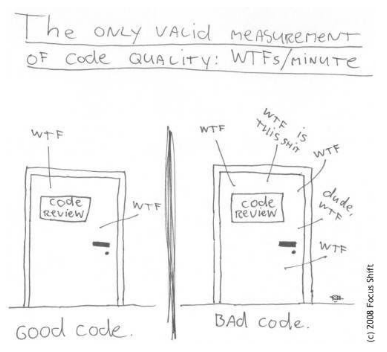

## Introduction

Imagine you are reading a well-organized book or following a simple recipe.
Each step is clear, easy to understand, and there's no unnecessary clutter.
Now imagine the opposite—a messy, confusing set of instructions where you’re
constantly backtracking to figure out what’s going on.
**This is the difference between "clean code" and messy code in programming.**

Here are the key ideas behind **Clean Code**:

- Readable and Understandable
- Well-Organized
- Minimal but Effective
- Easy to Test
- Follows Good Practices

&nbsp;

{alt='"Clean" vs. "Messy"'}

&nbsp;


### Why Clean Code Matters:

- **For Teamwork**: Most software projects involve multiple developers. Clean code ensures everyone can collaborate without getting stuck deciphering messy work.
- **For Longevity**: Code often lives longer than you think. Writing clean code saves you time in the future when making updates.
- **For Quality**: Clean code reduces bugs and improves the user experience of the software.


::: callout

Clean Code is code that's easy to read, maintain, understand for developers and other teams while improving the quality
of their software through structure and consistency with performance demands. It lets you get the most value and purpose
out of your software.

*https://www.sonarsource.com/solutions/clean-code/*

:::

::: callout

 What is clean code, anyway? Here are some of its features:

- Clean code is obvious for other programmers.
- Clean code does not contain duplication.
- Clean code contains a minimal number of classes and other moving parts.
- Clean code passes all tests.
- Clean code is easier and cheaper to maintain!

*https://refactoring.guru/refactoring*

:::

{alt='How to measure clean code?'}

In this episode we will cover the basics of clean code, introduce some tools that facilitate writing clean code,
and end with a refactoring exercise that will allow you to put these concepts into practice.

## Clean Code Rules

In this section, we will cover some basic rules that, when followed, lead to cleaner code. It's important to recognize
that these rules are just the "tip of the iceberg," as there is much more to explore on this topic. However, adhering to
these simple guidelines can significantly improve the quality of your code. As you grow into a more experienced developer
and adopt advanced software techniques, it remains valuable to stay aligned with "clean code" principles relevant to
these practices. Clean Code: A Handbook of Agile Software Craftsmanship by Robert C. Martin is often regarded as the
definitive guide for the clean code movement and is highly recommended reading.

### General Rules

- Follow standard conventions.
- Keep it simple stupid. Simpler is always better. Reduce complexity as much as possible.
- Boy scout rule. Leave the campground cleaner than you found it.

### Source code structure

- Separate concepts vertically.
- Related code should appear vertically dense.
- Declare variables close to their usage.
- Dependent functions should be close.
- Similar functions should be close.
- Place functions in the downward direction.
- Keep lines short.

### Names rules

:::::::::::::::::::::::::::::::::::::::::  callout

##### Choose descriptive and unambiguous names

A name of a function/variable should as much as possible reveal the reason why
that function/variable is necessary, and its intended use. Choosing a good name
takes time at the start but saves time in the long-run.

If first variable use requires a comment, you are probably using the wrong name:

```python
# BAD
d = 8  # elapsed time in days

# GOOD
elapsed_time_in_days = 8
```

Choosing names that reveal intend makes code much easier to understand, and will
save you (and everyone else who will be working with your code) a lot of time in the future:

```python
# BAD
def get_them(the_list):
    list1 = []
    for x in the_list:
        if x[2] = 5:
            list1.append(x)
    return list1


# GOOD
def get_flagged_cells(game_board):
    flagged_cells = []
    for cell in game_board:
        if cell[STATUS_VALUE] = FLAGGED:
             flagged_cells.append(x)
    return flagged_cells
```

::::::::::::::::::::::::::::::::::::::::::::::::::


:::::::::::::::::::::::::::::::::::::::::  callout

##### Use pronounceable names

Unpronounceable names are hard to use in a conversation. If names used in your
code are pronounceable, you can easily discuss them with your colleagues which
fosters collaboration.

```python
# BAD
def bld_dta_rcrd102(genymdhms, modymdhms):
    pszqint = "102"

    # continued in the same incomprehensible style
    # ...


# GOOD
def build_data_record_102(generation_timestamp, modification_timestamp):
    record_id = "102"

    # much easier to understand and review with your colleagues!
    # ...
```


::::::::::::::::::::::::::::::::::::::::::::::::::

:::::::::::::::::::::::::::::::::::::::::  callout

##### Use searchable names and replace magic numbers with named constants

Single letter names and "magic numbers" in the code are very difficult to
locate when you do a text search through your source code. As such, changing them
can be extremely error-prone. Replacing them with named constants can greatly
simplify this process:

```python
# BAD
def sum_up(t):
    s = 0
    ...
    for j in range(5):
        s += (t[j] * 4) / 5
    ...


# GOOD
def sum_work_days_per_week(task_estimate):
    REAL_DAYS_PER_IDEAL_DAY = 4
    WORK_DAYS_PER_WEEK = 5
    NUMBER_OF_TASKS = 5
    sum = 0
    ...
    for j in range(NUMBER_OF_TASKS):
        real_task_days = task_estimate[j] * REAL_DAYS_PER_IDEAL_DAY
        real_task_weeks = real_days / WORK_DAYS_PER_WEEK
        sum += real_task_weeks
    ...
```

::::::::::::::::::::::::::::::::::::::::::::::::::


### Functions rules

:::::::::::::::::::::::::::::::::::::::::  callout

##### Small

A function should be small enough so one could understand it without having to
do "mental jumps" between various parts of the code. Such "mental jumps" are
time consuming and tiring. Ideally, the entire function should fit on one screen.

What is easier to read, this:

``` python

# Dummy calibration function - operations shown here have no "real life" meaning
def calibrate_fridge(fridge_data, include_safety_checks):
    fridge_id = fridge_data.get("id")
    current_temp = fridge_data.get("current_temperature")
    target_temp = fridge_data.get("target_temperature")
    calibration_params = fridge_data.get("calibration_params")

    if include_safety_checks:
        if current_temp > calibration_params.get("max_safe_temperature"):
            raise Exception("Unsafe temperature detected during calibration.")
        if target_temp < calibration_params.get("min_safe_temperature"):
            raise Exception("Unsafe target temperature detected during calibration.")

    adjustment_factor = calibration_params.get("adjustment_factor", 1.0)
    adjusted_temp = current_temp + (target_temp - current_temp) * adjustment_factor
    if adjusted_temp > calibration_params["max_safe_temperature"]:
        adjusted_temp = calibration_params["max_safe_temperature"]
    if adjusted_temp < calibration_params["min_safe_temperature"]:
        adjusted_temp = calibration_params["min_safe_temperature"]

    stabilization_steps = calibration_params.get("stabilization_steps", 10)
    for step in range(stabilization_steps):
        correction_factor = 0.1 * (adjusted_temp - target_temp)
        adjusted_temp -= correction_factor

        if adjusted_temp < target_temp:
            adjusted_temp += 0.05  # Minor correction if under target
        elif adjusted_temp > target_temp:
            adjusted_temp -= 0.05  # Minor correction if above target

        temperature_variance = abs(adjusted_temp - target_temp)
        if temperature_variance < 0.01:
            break  # Break early if within small tolerance
        adjusted_temp -= 0.01 * temperature_variance

    fridge_data["final_temperature"] = adjusted_temp

    telemetry_data = {
        "fridge_id": fridge_id,
        "start_temp": current_temp,
        "end_temp": adjusted_temp,
        "safety_checks": include_safety_checks
    }

    print(f"Telemetry data: {telemetry_data}")

    return f"Calibration complete. Final temperature: {adjusted_temp:.2f}"
```

or this one:

``` python

# Function refactored into smaller functions
def calibrate_fridge(fridge_data, include_safety_checks):
    fridge_id = fridge_data.get("id")
    current_temp = fridge_data.get("current_temperature")
    target_temp = fridge_data.get("target_temperature")
    calibration_params = fridge_data.get("calibration_params")

    if include_safety_checks:
        perform_safety_checks(current_temp, target_temp, calibration_params)

    adjusted_temp = apply_temperature_adjustment(current_temp, target_temp, calibration_params)
    stabilized_temp = stabilize_temperature(adjusted_temp, target_temp, calibration_params)
    fridge_data["final_temperature"] = stabilized_temp

    send_telemetry(fridge_id, current_temp, stabilized_temp)
    return f"Calibration complete. Final temperature: {stabilized_temp:.2f}"


def perform_safety_checks(current_temp, target_temp, calibration_params):
    if current_temp > calibration_params["max_safe_temperature"]:
        raise Exception("Unsafe temperature: Current temperature exceeds safe limits.")

    if target_temp < calibration_params["min_safe_temperature"]:
        raise Exception("Unsafe target temperature: Below safe limits.")


def apply_temperature_adjustment(current_temp, target_temp, calibration_params):
    adjustment_factor = calibration_params.get("adjustment_factor", 1.0)
    adjusted_temp = current_temp + (target_temp - current_temp) * adjustment_factor

    if adjusted_temp > calibration_params["max_safe_temperature"]:
        adjusted_temp = calibration_params["max_safe_temperature"]
    if adjusted_temp < calibration_params["min_safe_temperature"]:
        adjusted_temp = calibration_params["min_safe_temperature"]

    return adjusted_temp


def stabilize_temperature(adjusted_temp, target_temp, calibration_params):
    stabilization_steps = calibration_params.get("stabilization_steps", 10)

    for step in range(stabilization_steps):
        correction_factor = 0.1 * (adjusted_temp - target_temp)
        adjusted_temp -= correction_factor

        if adjusted_temp < target_temp:
            adjusted_temp += 0.05  # Minor correction if under target
        elif adjusted_temp > target_temp:
            adjusted_temp -= 0.05  # Minor correction if above target

        temperature_variance = abs(adjusted_temp - target_temp)
        if temperature_variance < 0.01:
            break  # Break early if within a small tolerance
        adjusted_temp -= 0.01 * temperature_variance

    return adjusted_temp


def send_telemetry(fridge_id, start_temp, end_temp, safety_checks):
    telemetry_data = {
        "fridge_id": fridge_id,
        "start_temp": start_temp,
        "end_temp": end_temp,
    }
    print(f"Telemetry data: {telemetry_data}")

```

::::::::::::::::::::::::::::::::::::::::::::::::::


:::::::::::::::::::::::::::::::::::::::::  callout

##### Do one thing at one level of abstraction

The 'messy' code example above is difficult to comprehend, because the code
constantly jumps between different levels of abstractions: performing
low-level calibration and stabilization steps,fetching parameters, throwing
exceptions, etc.

Instead, 'clean' code should follow the **Stepdown Rule**: the code should read
like a top-down narrative - so we can read the program like a narrative,
descending one level of abstraction as we read down the list of functions.
This is what makes the refactored example so much easier to understand.

::::::::::::::::::::::::::::::::::::::::::::::::::


:::::::::::::::::::::::::::::::::::::::::  callout

##### Use descriptive names

This should follow the methodology already discussing under *Name rules*. In addition to this:

- Do not be afraid to use long names - the function name should pretty much describe
what the function does, to the point where comments become superfluous
- Spend time thinking of a good name, and change it as soon as you have found a better one
- Be consistent in your naming: use same phrases, nouns and verbs in your function names

``` python
# BAD
def determine_optimal_temperature():
def derive_calibration_parameters():
def calculate_reset_interval():


# GOOD
def calculate_optimal_temperature():
def calculate_calibration_parameters():
def calculate_reset_interval():
```

::::::::::::::::::::::::::::::::::::::::::::::::::


:::::::::::::::::::::::::::::::::::::::::  callout

##### Prefer fewer arguments

- Ideally have 0-2 arguments. A high number of arguments can make functions harder to
understand, test, and reuse.
- When multiple related arguments are necessary, encapsulate them in an object or data
structure to simplify the function signature and improve readability.

```python
# BAD
def calibrate_fridge(min_temperature, max_temperature, steps, accuracy, seconds_timeout):

# GOOD
@dataclass
class CalibrationParameters:
    min_temperature: float,
    max_temperature: float,
    steps: int,
    accuracy: float,
    seconds_timeout: int

def calibrate_fridge(calibration_parameters: CalibrationParameters):
...
```

- Functions should avoid boolean or flag arguments, as they often indicate that the function
is doing more than one thing and violate the *Single Responsibility Principle*
```python
# BAD
def update_fridge_temperature(new_temperature: float, initialize_fridge: bool):

# GOOD
def initialize_fridge():
def update_fridge_temperature(new_temperature: float):

```

::::::::::::::::::::::::::::::::::::::::::::::::::


:::::::::::::::::::::::::::::::::::::::::  callout

##### Have no side effects

- Side effects break the *Single Responsibility Principle*
- No side effects facilitate parallel execution
- Side effects can lead to subtle (and occasionally catastrophic) errors!

``` python
# VERY VERY BAD

def adjust_experiment_parameters(duration_in_seconds, calibration_steps):
    set_experiment_duration(duration_in_seconds)
    set_experiment_calibration_steps(calibration_steps)
    start_experiment()
```

::::::::::::::::::::::::::::::::::::::::::::::::::


### Comments rules

As a general rule, always strive to have the code "explain itself" so comments are
not necessary. In most cases, *comments are an acceptance of failure*: the code
itself is not clear enough, so it needs additional explanation in the form of a comment.

``` python
# BAD
# Check if the experiment is complete
if status == 1:
    handle_completion()

# GOOD
if is_experiment_complete(status):
    handle_completion()
```

#### Bad Comments

In many cases comments are useless, and occasionally straight dangerous:

:::::::::::::::::::::::::::::::::::::::::  callout

##### Redundant comments

Such comments can be a distraction for the reviewer

``` python
total = price * quantity  # Multiply price by quantity
```

::::::::::::::::::::::::::::::::::::::::::::::::::


:::::::::::::::::::::::::::::::::::::::::  callout

##### Outdated or misleading comments

``` python
# BAD
# This function sorts the list in descending order
def sort_list(data):
    return sorted(data, reverse=True)

# GOOD
def sort_list_ascending(data):
    return sorted(data)

def sort_list_descending(data):
    return sorted(data, reverse=True)
```

::::::::::::::::::::::::::::::::::::::::::::::::::


:::::::::::::::::::::::::::::::::::::::::  callout

##### Commented out code

Clutters the source code, and makes it harder to follow the natural flow of your program.
Use version control instead!

::::::::::::::::::::::::::::::::::::::::::::::::::

#### Good Comments

There are a number of cases when comments can be beneficial:

:::::::::::::::::::::::::::::::::::::::::  callout

##### Explanation of intent

``` python
# Use binary search to optimize performance on large datasets
def find_element(sorted_list, target):
    return binary_search(sorted_list, target)
```

::::::::::::::::::::::::::::::::::::::::::::::::::

:::::::::::::::::::::::::::::::::::::::::  callout

##### Clarification of code

``` python
# Flag transactions with an amount greater than 10,000 as "flagged" for manual review.
# This threshold is set by international banking regulations, specifically the
# Financial Action Task Force (FATF) Recommendation 10, to prevent money laundering.
MANUAL_REVIEW_THRESHOLD = 10000

def classify_transactions(transactions):
    for t in transactions:
        if t.amount > MANUAL_REVIEW_THRESHOLD:
            t.status = "flagged"
        else:
            t.status = "completed"

```

::::::::::::::::::::::::::::::::::::::::::::::::::

:::::::::::::::::::::::::::::::::::::::::  callout

##### Warning of consequences

```
# WARNING: This function permanently deletes experimental data.
# Ensure backups are created before calling.
def delete_experiment_data(experiment_id):
    database.delete(f"experiment_{experiment_id}")
```

::::::::::::::::::::::::::::::::::::::::::::::::::


### Unit Test Rules

- Should follow the **F.I.R.S.T** principles:
    - **F**ast
    - **I**ndependent
    - **R**epeatable
    - **S**elf-validating
    - **T**imely
- Should be as "clean" as the rest of the code!
- Should be easy to run
- should be used in conjunction with a test coverage tool


## Clean Code Tools

### Python Coding Conventions

- Introduce https://peps.python.org/pep-0008/
- Advice: select a few rules, and start applying them consistently to your code:
    - Indentation
    - Maximum line length
    - Whitespaces in Expressions and statements
    - Naming conventions
- Expand your rule selection


### Linters - PyLint

- Introduce PyLint, explain what it does
- Installing and running PyLint
- Run PyLint on a code sample

### Modern Development Environments - PyCharm

- Introduce PyCharm, show how to setup a Python interpreter for a project
- Show how PyCharm is highlighting parts of the code that do not follow coding conventions
- Show how PyCharm can help with re-factoring - e.g. changing a variable/function name

### Unit Tests and Test Coverage

- Introduce PyTest
- Introduce the concept of test coverage
- Introduce the *coverage.py* tool
    - how to install it
    - how to run it
    - how to visualize test coverage


## Clean Code/Refactoring Exercise

Interactive coding exercise which can be done individually or in small groups:

- Introduce a small to medium size Python program specifically crafted to break all clean code rules outlined in this episode.
- Participants are instructed to run PyLint on this program - the score will be extremely low!
- Goal of this exercise is to refactor the code to bring the score above 8
- Before starting this process, unit tests should be added.
- Participants should run the *coverage.py* tool on their tests and ensure the critical paths in the code are covered
- Once test coverage is achieved, start re-factoring, applying the clean code techniques learned in this episode
- After each refactoring, the unit tests should pass, which ensures functionality has not been broken.
- After each refactoring, participants should re-run the linter, and see how the code score improves.


