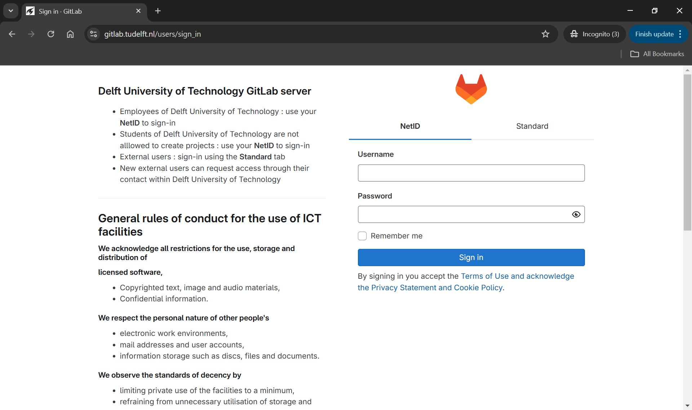
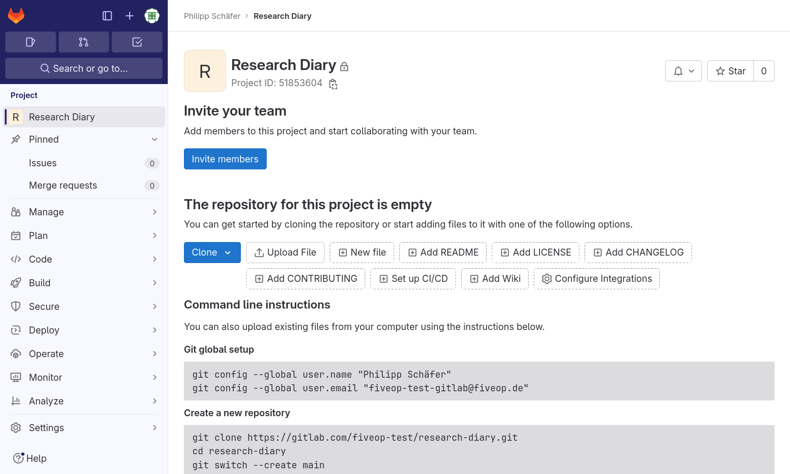

:::::::::::::::::::::::::::::::::::::: questions 

- What is GitLab?
- How can I find my way around GitLab?
- How can I create, modify and archive a GitLab project?
- How can multiple people collaborate on a project?

::::::::::::::::::::::::::::::::::::::::::::::::

::::::::::::::::::::::::::::::::::::: objectives

- Use GitLab’s interface to find a project.
- Use GitLab’s interface to find groups.
- Create a project.
- Change name, description, visibility, and avatar of a project.
- Archive (or delete) a project.
- Explain the concepts of members and roles.
- Add a member to a project.
- Contribute to a project that you are a member of.

::::::::::::::::::::::::::::::::::::::::::::::::

## Introduction

[GitLab] is a web application for managing [Git] repositories.
Since it is build around Git, it is suitable to manage any project that works primarily with
plain text files, for example software source code, TeX based documents, or meeting notes in Markdown.
With its built-in issue and wiki systems, it can, in certain cases, even be the right tool for managing
a project without any files.

This episode will give you a foundational understanding of GitLab’s features, so you can make
informed decisions on how to use it as a tool.

TU Delft is running their own self-hosted [GitLab instance]. As a QuTech employee, you
are entitled to use this TUD GitLab instance; you can login to it with your NetID:

{alt='TUD GitLab Login Page'}

[Git]: https://git-scm.com/
[GitLab]: https://about.gitlab.com/
[GitLab instance]: https://gitlab.tudelft.nl/

## Navigation

When we log into GitLab for the first time, we are greeted by a welcome page:

{alt='TUD GitLab Login Page'}

The “Explore projects” page looks like this:

{alt="Explore projects page with tab “Most starred” open.
The tab shows a list of projects with icon, name, descriptions, and four statistical values for each entry."}

The first tab, “All”, lists all projects that  are visible to you in most recently updated order.

The second tab, “Most starred projects”, also lists all projects, but this time ordered most
starred first. Users of a GitLab instance can “star” a project, which is the equivalent of
bookmarking them, as we will see shortly.

The third tab, “Trending”, lists all projects again, but this time ordered by activity during
the previous months.

You can use the filter field next to the tab names to search through all projects that
are visible to you.

In the next section we will explain how you can create new GitLab projects

## GitLab Projects

### Creating a Project

After knowing how to find groups and projects, we want to go from passively
browsing GitLab to actively using it. We are going to create a project and
connect a local Git repository to it.

To create a project, we click on the button with the “+” symbol near the top of the side menu on
the right and select “New project/repository”.

Multiple options are presented for how to create the new project. In this lesson
we will only look at, and use, the first option: “Create blank project”. So
click on that.

This leads to the following page:

{alt='Create blank project form'}

The “Project name” field is for just that, the project name. Its value has no
other purpose and can be changed at anytime without indirect consequences (the
direct consequence being, that its name will be different). We will call it
“Research Diary”.

As we fill in the project name, a project slug gets suggested in the respective
field. The project slug is the last part of the project’s, and the associated
Git repository’s, URL or web address.

If the user belongs to at least one group, the URL’s middle part can be chosen in the drop-down
field labeled “Project URL”, which defaults to the current user’s username.
The default, indicated by the user’s name, is the location for a user’s projects (and groups).
Other options in the drop-down list are the groups in which the current user may create projects.

::: callout

##### Project URL and Project Slug

The two fields under labels “Project URL” and “Project slug” are the only fields in this form for
which changing the value later might cause problems. They determine the URL under which the project’s
pages and the project’s Git repository can be found, so changing them later might brake links and
bookmarks as well as connections from Git repositories on other systems, for example on
contributors’ machines.

:::

We ignore the field labeled “Project deployment target (optional)”.

The choice under label “Visibility Level” determines the project’s visibility.

::: callout

##### Visiblity

GitLab offers three settings for the visibility of a project: public, internal, and private.
Publicly visible projects can be looked at by anyone that can access the GitLab instance, projects
with internal visibility can be looked at by anyone logged in to the instance, while projects with
private visibility can only be looked at by its members.

On GitLab.com the visibility “internal” is disabled. Everyone can create an
account, log in to the instance, and thus could look at any project of
internal visibility anyway.

Self-hosted instances might also disable some visibility types. For example,
the public visibility might be disabled, to prevent users from publishing
something to the whole internet.

:::

We choose “Private” for our project’s visibility.

If, as per default, the checkbox “Initialize repository with a README” is checked, the project’s
repository will be initialized with a commit that adds a file called `README.md`.
Otherwise, a the project will start with an empty repository.
We will add such a file later ourselves, so we uncheck the box.

::: callout

##### README

A project’s README file usually contains basic information about the project: what it contains,
how it can be used (for example built or installed, if it is a software project), how to contribute,
how to get help, and licensing information.

It is common to write README files in Markdown format, indicated by the
filename suffix `.md`.

Platforms like GitLab show the contents of a project’s README file on its
homepage; if it is in Markdown format, in its rendered form.

:::

We will ignore any other fields that may be visible depending on the GitLab
instances configuration.

After clicking the “Create project” button, GitLab creates the project and
redirects us to the project’s homepage, which looks similar to this:

{alt='Project homepage for a new project'}

The page is split into the menu on the left and the project overview on the
right.

The menu leads to pages related to various properties, processes, and content of
the project. It is visible on each of these pages. The number of menu entries
may seem overwhelming, in particular when one notices that the entries have
sub-entries. However, it is not necessary to know what hides behind all these
entries to use GitLab. Following this lesson, we will get to know parts of what
lies behind the entries “Manage”, “Plan”, "Code", “Build”, and “Settings”.

The project overview shows (from the top): The project’s avatar (or icon) and name;
a prompt to invite team members (we will cover members later on);
a statement that our repository is currently empty with buttons for
several options to add content to it; and finally the beginning of the
instructions on how to push a local repository to this project’s repository to
fill it with content. We will follow them in just a bit.

The project overview page will look slightly different, once we have content in
its repository. We will have another look at the page then.

::: challenge

##### Change Name, Description, Visibility, or Avatar

Click on the “Settings” sub-menu and select its “General” entry.
Set the description to “My research diary, a collection of Markdown files”.

The project description appears in many lists and on some pages under the
project’s name.

Then change any of the project’s name, visibility, or avatar.
Do not forget to click the “Save changes” button once you are done.

This exercise should take about 5 minutes.

:::

::: callout

##### Markdown

Markdown is a markup language like HTML, on which the World Wide Web is based, or wikitext,
which is used to write Wikipedia’s content.
Its markup directives, indicating
for example that something is a headline or a list item, are such that they
serve their purpose even in the plain text form.

:::

The project overview page presents us with many options to add content to the project’s repository
directly in GitLab. We will add our first file to the project repository in the next section.

### Archiving a Project

We just went through the beginning of a GitLab project’s life cycle.
At its end, if it has one, a project gets archived (or deleted).
We will now go through the process of archiving a project, without completing the procedure.

Using the menu on the left, we navigate to the project’s “General” settings.

At the bottom of the page, we find a section named “Advanced”.
We click on the “Expand” button right next to it and scroll down the page.

Notice that some of buttons here are not the usual blue or white, but rather red.
This indicates that we should be careful about clicking them.
Things might break or get deleted.

Scrolling back up, we find a section labeled “Archive Project”. Clicking the
button will not delete the project. Instead it will be placed in a read-only
mode. Everything will be preserved but nothing can be changed anymore. In
addition, the project no longer shows up in search results and on the page for
exploring projects.

Most of the time archiving a project is preferable to deleting it, in particular
when it comes to research projects. **Do not archive the project now! We will
work with it throughout this lesson.**

At the bottom of the page is also a section for deleting a project, in case you
ever think that is the right thing to do.

## Adding Project Members

So far, each of you has created a GitLab project that no one but you can
contribute to; depending on the visibility setting, no one but you might be able
to even see it.

Git and GitLab can be and is used for one-person projects. But we want our
colleagues to contribute to our research diary, when they keep tabs on our
experiments for us on the weekends. To achieve this, we will grant others access
to our GitLab project.

Using the menu on the left side of the project homepage (or nearly any other
project page), we navigate to the project members page hovering over or clicking
on "Manage" and then clicking on "Members" in the submenu. The
project member page should look similar to the following screenshot:

{alt='Project Members page'}

On the page we can see the page title, "Project members", three buttons to the
left of the title, and a filterable table of members, currently only listing
ourselves.

The table shows our full name and account name, why we are a member of this project,
what our maximum role is–more on that in a bit–, when we got access—at the moment we
created the project—, a disabled membership expiration date widget, and three dates on
our activity.

For practice we will all add an instructor to our project and remove them again
right away. Click the button labeled "Invite members", type in the username your
instructors provided you with into the search field, make sure that "Guest" is
selected as a role, and click the button labeled "Invite".

Your instructor should now be listed next to you in the table.
Unlike in your row, you can change the role and the expiration date of this new entry.

The role determines what the member is allowed to do in the project.
An owner has full rights, a guest almost none.
GitLab’s handbook gives a detailed [overview](https://docs.gitlab.com/ee/user/permissions.html) of
the different roles’ permissions.

Now, we are going to remove the instructor from your project’s members again.
Click the three dots on the right in the instructor’s row, then click on "Remove member", and
finally click the button of the same name in the popup dialog.
The page reloads itself and the entry vanishes from the table.

::: challenge

##### Adding Members

Get into pairs and add each other with the role "Maintainer" to your projects.

The "Maintainer" role grants just enough permissions for all the collaborative
tasks we will practice in this lesson.

This exercise should take about 5 minutes.

:::

&nbsp;
&nbsp;
&nbsp;

::::::::::::::::::::::::::::::::::::: keypoints 

- Projects are GitLab’s primary entity of organization.
- You can explore/search projects visible to you on the “Explore projects” page.
- Groups can contain projects and other groups.
- You can explore/search groups visible to you on the ”Explore groups” page.
- Creating a GitLab project requires not more than a few clicks and providing a name.
- A project’s visibility can be set to either private, internal, or public.
- Adding others as members allows them to directly contribute to your projects
- Members with sufficient rights can independently contribute to repositories

::::::::::::::::::::::::::::::::::::::::::::::::

